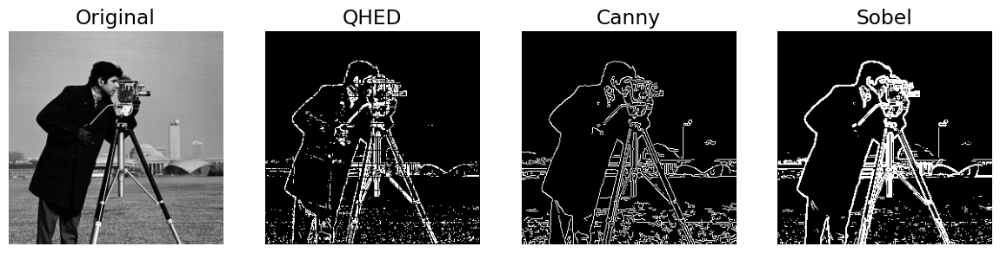
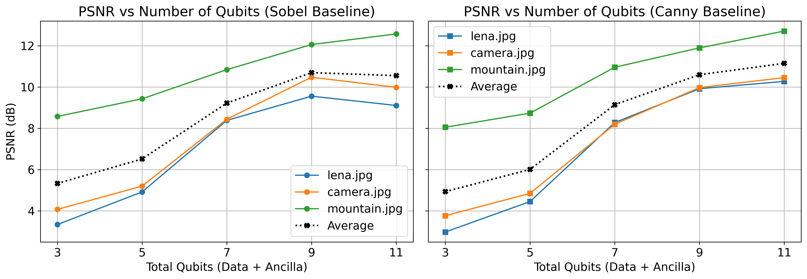
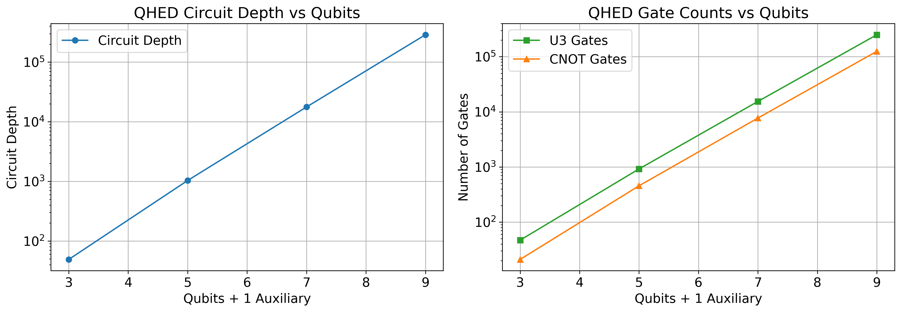

# Quantum Image Edge Detection

## Motivation & Research Question

Edge detection is fundamental to image analysis, but classical methods struggle with the efficiency and scalability needed for increasingly large, high-resolution image datasets. This project explores if **Quantum Image Processing (QIP)** can offer a more efficient alternative.

Our **research question** is Can Quantum Image Processing, specifically using the Quantum Hadamard Edge Detection (QHED) algorithm with Quantum Probability Image Encoding (QPIE), offer a viable and potentially more efficient alternative to classical edge detection methods, particularly concerning resource utilization and computational complexity for large-scale image data?

---
## Method & Implementation

1.  **Quantum Image Encoding (QPIE):** Representing grayscale images (or patches) by encoding pixel intensities into the probability amplitudes of an $n$ qubit quantum state ($|\text{Img}\rangle = \sum c_k |k\rangle$), achieving exponential compression in qubit resources ($n = \lceil \log_2 N \rceil$). This was implemented in Qiskit using the `initialize` function.
2.  **Quantum Hadamard Edge Detection (QHED):** Applying a quantum circuit involving Hadamard gates and an $(n+1)$ qubit amplitude permutation unitary ($D_{2^{n+1}}$) to the QPIE state (plus one ancillary qubit). This process computes pixel intensity differences in parallel. For 2D images, this is done for both horizontal and vertical orientations.
3.  **Simulation & Patch-Based Processing:** Due to simulator limitations, $256 \times 256$ test images ("mountain," "lena," "camera") were processed by dividing them into smaller $w \times w$ patches. Each patch underwent the QPIE-QHED pipeline using Qiskit's Aer `statevector_simulator`.
4.  **Evaluation:**
    *   **Qualitative:** Visual comparison of QHED edge maps against classical Canny and Sobel outputs.
    *   **Quantitative:** Peak Signal-to-Noise Ratio (PSNR) analysis using Canny/Sobel as baselines.
    *   **Complexity:** Analysis of qubit count, circuit depth, and gate counts.

--- 
## How to Install and Run the Project

The code for this project is contained within Quantum_Image_Edge_Detection.ipynb
1. **Setup Environment:** Ensure Python 3.x is installed and install the necessary libraries.
2. **Download Images:** Place the test images ("mountain.jpg", "lena.jpg", "camera.jpg") in a directory accessible by the script. Update paths in the script if necessary.
3. **Run the Script/Notebook:** Execute the Python script or run the cells in the Jupyter Notebook. The script will:
    - Define functions for QPIE, QHED, and plotting.        
    - Process an 8x8 example image and generate a 3D bar plot (qhed_3d_bar.png).
    - Perform patch-based QHED on the 256x256 images
    - Analyze and plot circuit complexity scaling (qhed_circuit_scaling.png).
    - Analyze and plot PSNR vs. qubits (psnr_qubits.png).
    - Generate and display side-by-side comparisons of original, QHED, Canny, and Sobel edge maps.
---
## Results Overview & Known Issues

*   **Qualitative Results:** QHED successfully identified prominent edges, visually comparable to classical methods (Figures 1-3 in the paper/poster). Some blockiness was observed due to the patch-based approach.
    
*   **Quantitative Results (PSNR):** PSNR values generally increased with larger patch sizes (more qubits), indicating improved similarity to classical outputs (Figure 5 in paper/poster).
    
*   **Complexity:**
    *   QPIE offers exponential qubit compression.
    *   The core QHED logic is theoretically efficient.
    *   However, simulated full circuit depth and gate counts (using general Qiskit `initialize` and `unitary`) scaled exponentially with qubits per patch, a current practical limitation (Figure 6 in paper/poster).
    `
*   **Known Issues:** The primary "issue" is the gap between theoretical quantum speedups and the practical overhead observed in simulations using general-purpose quantum operations, especially for state preparation. The patch-based method, while necessary for simulation, can also introduce boundary artifacts in the final image.
---
## Credits

**Student Researchers:** Aayush Jalgaonkar, Pratham Maliya  
**Mentor:** Mr. Manuel Rudolph

---
## Conclusion and Future Work

Our simulations demonstrate that QHED with QPIE can perform edge detection with results qualitatively similar to classical methods. While QPIE provides significant qubit resource compression and the core QHED algorithm has theoretical efficiency, the overall simulated circuit complexity (dominated by state preparation and general unitary operations) scales unfavorably with qubit count in current frameworks. The measurement overhead for full classical image reconstruction also poses a challenge to achieving practical quantum advantage.

Further research in Quantum Image Processing and Edge Detection could explore:
1.  Developing and implementing more optimized quantum circuits for QPIE state preparation and the specific $D_{2^{n+1}}$ permutation unitary.
2.  Investigating alternative or hybrid QImRs that might offer better trade-offs between qubit cost, encoding complexity, and suitability for edge detection.
3.  Adapting QHED for execution on current Noisy Intermediate-Scale Quantum (NISQ) devices, incorporating error mitigation techniques, and benchmarking real hardware performance.
4.  Investigating hybrid quantum-classical models where quantum processing handles specific sub-tasks.
5.  Applying QHED principles to tasks where full classical readout is not required, potentially leveraging quantum features directly for further analysis.
6.  Applying the learned principles and QHED variants to other image processing tasks such as denoising, segmentation, or pattern recognition.
---
## References

1. Yao, Xi-Wei, et al. "Quantum Image Processing and Its Application to Edge Detection: Theory and Experiment." *Phys. Rev. X*, vol. 7, no. 3, 2017, pp. 031041. American Physical Society. [https://link.aps.org/doi/10.1103/PhysRevX.7.031041](https://link.aps.org/doi/10.1103/PhysRevX.7.031041)
2. Various authors. *Qiskit Textbook*. Github, 2023. [https://github.com/Qiskit/textbook](https://github.com/Qiskit/textbook)
3. Zhang, Yi, et al. "NEQR: A Novel Enhanced Quantum Representation of Digital Images." *Quantum Information Processing*, vol. 12, no. 8, 2013, pp. 2833–2860. [https://doi.org/10.1007/s11128-013-0567-z](https://doi.org/10.1007/s11128-013-0567-z)
4. Le, Phuc Q., Dong, Fangyan, and Hirota, Kaoru. "A Flexible Representation of Quantum Images for Polynomial Preparation, Image Compression, and Processing Operations." *Quantum Information Processing*, vol. 10, no. 1, 2011, pp. 63–84. [https://doi.org/10.1007/s11128-010-0177-y](https://doi.org/10.1007/s11128-010-0177-y)
5. Giovannetti, Vittorio, Lloyd, Seth, and Maccone, Lorenzo. "Quantum Random Access Memory." *Physical Review Letters*, vol. 100, no. 16, 2008. [http://dx.doi.org/10.1103/PhysRevLett.100.160501](http://dx.doi.org/10.1103/PhysRevLett.100.160501)
6. Zhang, Yi, Lu, Kai, and Gao, YingHui. "QSobel: A Novel Quantum Image Edge Extraction Algorithm." *Science China Information Sciences*, vol. 58, 2014. [https://doi.org/10.1007/s11432-014-5158-9](https://doi.org/10.1007/s11432-014-5158-9)
---

> The research poster for this project can be found in the [BeyondQuantum Proceedings 2025](https://thinkingbeyond.education/beyondquantum_proceedings_2025/).
> The research paper for this project can be found in the same folder as this README, under the filename `quantum_image_edge_detection.pdf`. 
