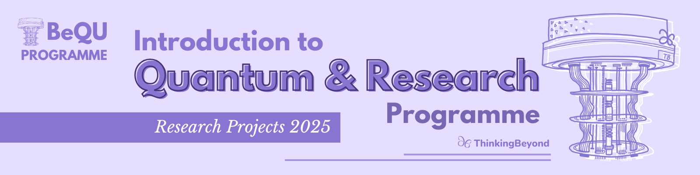

# BeyondQuantum: Introduction to Quantum and Research 2025
This repo contains the research project submissions for the [BeyondQuantum programme](https://thinkingbeyond.education/beyondquantum/) in 2025. It contains project on Quantum Computing, Quantum Machine Learning and Foundations of Quantum Physics. The accompanying research posters for each project can be found in the [BeyondQuantum Proceedings 2025](https://thinkingbeyond.education/beyondquantum_proceedings_2025/).

For the individual research projects please navigate to the folder of each team.
