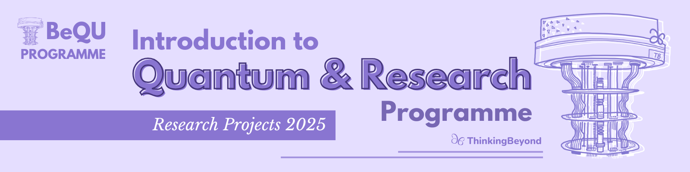

# Noise Effects on Measurement-Device-Independent Quantum Key Distribution

## Introduction
Have you ever wondered whether a credential information you send to another person actually remains secure between the two parties? Are there any potential ways you could determine whether some tried decrypting it? That’s where Quantum Cryptography comes to play! By encoding bits into polarized photon states, quantum cryptography utilizes quantum mechanical principles to ensure that your information remains secure. 

Our research focused on dividing deep into understanding a limitation of the quantum key distribution’s BB84 protocol: the impacts on the secure key by the vulnerable measurement device. We learned that one of the most effective ways to remove this limitation and make quantum cryptography more practical is by implementing the Measurement-Device-Independent quantum key distribution (MDI QKD): in this protocol, the key never gets impacted by the measurement device. The bonus? The protocol may involve untrustable third parties. We implemented the protocol on Qiskit to visualize the way it works.

That’s not it- our research further dived deep into the noise effects compared to the Quantum Bit Error Rate (QBER) on MDI-QKD compared to other QKD protocols to deduce conclusions as to the possible limitations of MDI-QKD. The reason for this is that we want to make sure that this protocol is completely applicable and the main concerns are considered. We simulated the BB84, B92 and E91 protocols on Qiskit, implemented noise effects and QBER for all three protocols as well as for the MDI-QKD protocol. Further research could be implemented on concluding the most effective methodology to improve the model discussed in our research.

## Research Question

Our research question had two main parts: the first one focuses on the MDI-QKD protocol and the second question considers the limitations. As mentioned previously, the purpose of having two parts was to make sure we not only explain how this particular protocol is promising but also look at it from a practical and applicable perspective.

Research question:
1. How can we remove the vulnerabilities of measurement devices in Quantum Key Distribution?
2. How are noise effects a limitation of removing these vulnerabilities? 

## Motivation

Quantum Key Distribution (QKD) promises theoretically unbreakable encryption based on the laws of quantum mechanics. However, many practical implementations, including the well-known BB84 protocol, are vulnerable to attacks that exploit weaknesses in the measurement devices. These side-channel attacks compromise the security of the key, undermining the core advantage of QKD. While Measurement-Device-Independent QKD (MDI-QKD) was proposed to solve this issue, it introduces its own set of practical challenges, especially under noisy conditions. Therefore, our motivation for this research project was to investigate the effectiveness of MDI-QKD in the presence of noise and compare it to other QKD protocols, with the goal of understanding its limitations and potential for real world applications.

## Key Difference between MDI-QKD and BB84
The goal of quantum cryptography is to ensure the secure information gets transmitted to the recipient safely without having it decrypted by an eavesdropper. In classical cryptography, a key is encrypted using complex mathematical problems such as integer multiplication. In modern computers, these can be decrypted much faster, and the sender and recipient would not notice the change in the keys. Therefore, quantum cryptography uses quantum mechanical principles to ensure the key is transmitted securely, and the sender + recipient would notice if an eavesdropper tried decrypting it. 

How is that? Quantum cryptography uses polarized photon states. Photons can oscillate, and polarized photons can oscillate only in one direction, either horizontal, vertical, diagonal or anti-diagonal. The most common protocol in quantum cryptography is BB84. In the BB84 protocol, we have two different parties: a sender of the key and a recipient. Here are the steps in BB84:
1. The sender (referred to as Alice in quantum cryptography) would encode the message in bits
2. For each bit, Alice would choose a specific basis: vertical, horizontal, diagonal, or anti-diagonal.
3. Alice will send now send the polarized photon states to the recipient (Bob) through an optical fibre which is a primary medium for photon transmission
4. Bob would choose a random basis and measure the photon. Bob will record each of the results
5. After steps 1-4 are completed, Alice and Bob will publicly share their basis. Because the basis does not contain the key information themselves, publicly sharing the basis will not help anyone else decrypting it.

Why is this effective?
Superposition in quantum mechanics plays a huge role in understanding why QKD works better than classical cryptography. That’s because once the states are measured, if they are measured incorrectly, then the state would collapse into one state, indicating an error that can be noticed by Alice and Bob later on. This is where the Heisenberg Uncertainty Principle comes in.
Eve does not actually know whether she is right or wrong with the measurements because she has to randomly choose a basis just like Bob, keeping the probability of getting all the bits correct very low. Additionally, due to the no-cloning theorem, photon states can not exactly be copied by the eavesdropper later on.

However, the big issue we face in the BB84 protocol is that the key relies upon a measurement device. This measurement device can be weak and vulnerable, making it susceptible to errors. To solve this problem, we dived deep into the Measurement-Device-Independent Quantum Key Distribution protocol which ensures that the key itself is not altered by the measurement device. The way MDI-QKD works is simple:
1. Both Alice and Bob encode choose phase-randomized weak coherent light pulses
2. They then encode their own random bits into each pulse using the same states from BB84. These are the same basis from the BB84 protocol
3. They implement the decoy state and modulate each pulse using an optical intensity modulator to prevent photon-number-splitting attacks
4. Both Alice and Bob send the photon pulses to Charlie, who is a central third party and can be untrusted
5. Charlie performs partial Bell State Measurements to see which photon pulses have entanglement-like correlations. Charlie does not have any information about the key itself which is why he can be untrusted.
6. Charlie sends the successful partial Bell State Measurements to Alice and Bob. Alice and Bob publicly share their basis and discard the wrong measurements
7. Alice and Bob uses QBER to check for errors that Charlie may have made

## Methodology and Implementation

The ultimate goal for implementation was to ensure that we considered all the 3 main types of quantum key distribution protocols (which are BB84, B92 and E91) as well as the MDI-QKD protocol, and develop a noise simulation for all of them. With the help of Qiskit on Google Colab, we successfully implemented the prototype and simulation for all of these protocols for easier visualization on the data.

### BB84 Protocol and Noise Simulation
In the BB84 protocol, Alice prepares qubits in one of two conjugate bases (Z or X) and sends them to Bob, who independently chooses a measurement basis. Only measurements where the sender's and receiver's bases match are retained for the final shared key.
We implemented BB84 using Qiskit's AerSimulator and created quantum circuits that encoded and measured qubits based on randomly chosen bit values and bases. To simulate real-world imperfections, we added a depolarizing noise model, which introduces random Pauli errors (X, Y, Z) with a configurable probability.
To evaluate performance under noise, we ran the simulation across a range of depolarization intensities and calculated the QBER for each. QBER was computed as the proportion of mismatched bits in the sifted key (where Alice’s and Bob’s bases matched). The results were visualized by plotting QBER against noise intensity, revealing a clear trend of increasing error with higher noise levels.

### E91 Protocol and Noise Simulation
The E91 protocol relies on quantum entanglement and Bell inequality violations to establish secure correlations between two parties. Alice and Bob each measure their half of a shared entangled qubit pair using randomly chosen bases defined by specific rotation angles (e.g., 0°, 45°, 90° for Alice and 22.5°, 67.5°, –22.5° for Bob). When their bases are compatible, they use the correlated outcomes to generate a key.
We created entangled Bell states and applied measurement rotations corresponding to each party’s chosen angle. To simulate noise, both single  and two qubit depolarizing errors were introduced to the quantum circuit. The simulation then computed the QBER across varying noise levels, again highlighting how increasing decoherence impairs key generation accuracy.

### MDI-QKD Protocol and Noise Simulation
For the implementation of the MDI-QKD protocol, we simulated a three party scenario where Alice and Bob independently prepared qubits based on randomly selected bits and bases (X or Z). These qubits were then measured via a simulated Bell state measurement, performed by an untrusted third party (Charlie), using a circuit that applied a CNOT gate followed by a Hadamard and measurement in the computational basis. The code structure used Qiskit’s QuantumCircuit, and each simulation round output a two bit string (e.g., '00', '11') indicating the Bell measurement result. Only instances where Alice and Bob used matching bases and bit values were retained in the sifted key.
Depolarizing noise was introduced as a configurable parameter in extended versions of the circuit, although not shown explicitly in the provided code snippet. To model the noise realistically, a noise model applying single qubit depolarizing errors was applied to both Alice’s and Bob’s qubits before they reached Charlie’s Bell measurement. The noise level was varied across different runs using a parameter noise, allowing us to measure the effect of increasing noise on the protocol’s quantum bit error rate (QBER). The function run_qber_vs_noise_plot() systematically ran the simulation at multiple noise intensities, collecting QBER values and plotting them to visualize how noise degrades the fidelity of key generation in the MDI-QKD protocol.

## Results
To measure how noise affects the MDI protocol we used Quantum Bit Error Rate (QBER), a performance metric which represents the percentage of incorrect qubits in a secret key. Receiving incorrect bits can allow an eavesdropper to go undetected, so QBER reflects a QKD’s vulnerability. Depolarizing noise, which randomly alters a qubit’s state, simulates realistic channel imperfections. We plotted the effect of increasing depolarizing noise on QBER for MDI, BB84, E91, and B92.

## Conclusions
- The measurement-device-independent quantum key distribution protocol is one of the most promising ways to remove side-detection channels which can be weak and vulnerable. This is a cutting-edge protocol because it makes quantum key distribution much safer and more applicable in the light of cryptography.
- In our result for the noise effects on MDI-QKD compared to other protocols, MDI shows a nonlinear QBER trend with sharp fluctuations, similar to entanglement-based protocols like E91 and B92. In contrast, BB84 exhibits a linear increase in QBER as depolarizing noise rises. BB84 involves only Alice and Bob, and depolarizing noise affects qubits uniformly. This allows straightforward error correction methods, such as increasing redundancy based on the measured QBER.
- MDI, however, introduces a third party measurement and relies on photon indistinguishability. Depolarizing noise disrupts interference visibility, making QBER highly sensitive and unpredictable. Therefore, MDI requires adaptive, block-based error correction strategies that respond to local QBER variations.

## Future Work

Our research highlighted the potential of MDI-QKD in addressing measurement device vulnerabilities, but also revealed its sensitivity to depolarizing noise and the resulting non linear behavior of the Quantum Bit Error Rate (QBER) in QKD protocols that rely on third party measurement, such as the  MDI-QKD or entanglement such as the B92 and E91 protocls. These findings open several directions for further research.

One promising area is the implementation and testing of adaptive error correction strategies tailored to MDI-QKD, such as evaluating the performance of the Cascade protocol or other block based methods under varying noise conditions. These could help stabilize QBER fluctuations and improve protocol robustness.

Additionally, future work could explore the effect of different types of quantum noise, such as phase damping or amplitude damping, and how they compare to depolarizing noise in terms of their impact on secure key generation. Investigating how key generation rates change under these different noise models could also provide insights into the efficiency and scalability of MDI-QKD in practical applications.

We also recommend a deeper analysis of the non linear QBER peaks observed in MDI and entanglement based protocols like E91 and B92. Understanding the pattern and cause of these fluctuations could lead to more resilient and predictable protocol designs.

Further studies could involve simulating potential eavesdropping attacks, such as photon number splitting or Trojan horse attacks, to assess the protocol's security beyond idealized noise models. Finally, expanding the comparison to additional QKD protocols and integrating them into larger quantum communication frameworks could provide a broader understanding of the strengths and trade offs involved in each approach.

## References

1. Khanna, A., Majumder, S., Jain, A., & Singh, D. K. (2023). Quantum BER estimation modelling and analysis for satellite‐based quantum key distribution scenarios. IET Quantum Communication, 5(2), 157–163. https://doi.org/10.1049/qtc2.12081
2. Lo, Hoi-Kwong, et al. “Decoy State Quantum Key Distribution.” Physical Review Letters, vol. 94, no. 23, 16 June 2005, https://doi.org/10.1103/physrevlett.94.230504. Accessed 8 Mar. 2021.
3. Ogburn, Monique, et al. “Homomorphic Encryption.” Procedia Computer Science, vol. 20, 1 Jan. 2013, pp. 502–509, www.sciencedirect.com/science/article/pii/S1877050913011101, https://doi.org/10.1016/j.procs.2013.09.310.
4. Sharma, V., Thapliyal, K., Pathak, A., & Banerjee, S. (2016). A comparative study of protocols for secure quantum communication under noisy environment: Single-qubit-based protocols versus entangled-state-based protocols. Quantum Information Processing, 15(11), 4681–4710. https://doi.org/10.1007/s11128-016-1396-7
5. Tang, Z. (2016). Measurement-Device-Independent Quantum Cryptography [PhD Thesis, University of Toronto]. In Unive. https://utoronto.scholaris.ca/server/api/core/bitstreams/2fb1bcab-bbbc-44d4-9534-ab632db104a9/content
6. Xu, F., Curty, M., Qi, B., & Lo, H. (2013). Practical aspects of measurement-device-independent quantum key distribution. New Journal of Physics, 15(11), 113007. https://doi.org/10.1088/1367-2630/15/11/113007
7. GeeksforGeeks. “Advanced Encryption Standard (AES).” GeeksforGeeks, 16 July 2024, www.geeksforgeeks.org/advanced-encryption-standard-aes/.
8. Wang, Weilong, et al. “Measurement-Device-Independent Quantum Key Distribution with Leaky Sources.” Scientific Reports, vol. 11, no. 1, 18 Jan. 2021, https://doi.org/10.1038/s41598-021-81003-2.
9. Rocha, V, et al. An Overview on Homomorphic Encryption Algorithms an Overview on Homomorphic Encryption Algorithms. 2018.
10. Tan, Si-Hui, et al. “A Quantum Approach to Homomorphic Encryption.” Scientific Reports, vol. 6, no. 1, 23 Sept. 2016, p. 33467, www.nature.com/articles/srep33467, https://doi.org/10.1038/srep33467.
11. Schranz, Ágoston, and Eszter Udvary. “Quantum Bit Error Rate Analysis of the Polarization Based BB84 Protocol in the Presence of Channel Errors.” Proceedings of the 7th International Conference on Photonics, Optics and Laser Technology, 2019, pdfs.semanticscholar.org/32a5/d9338c4e0c02e3ed33e7a6afe8347b594457.pdf, https://doi.org/10.5220/0007384101810189.

---

> The research poster for this project can be found in the [BeyondQuantum Proceedings 2025](https://thinkingbeyond.education/beyondquantum_proceedings_2025/).

